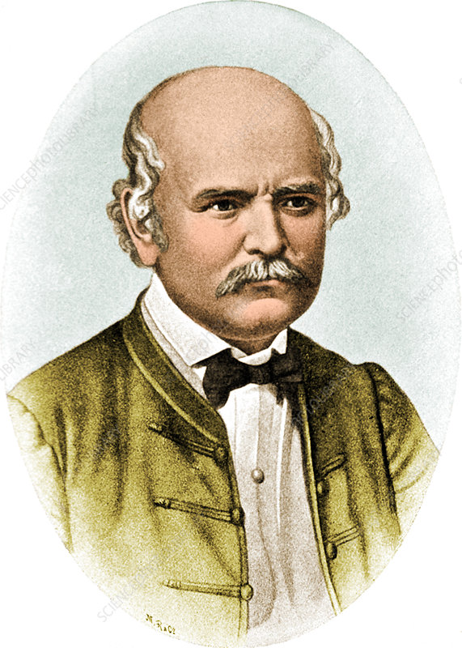

# **The Discovery of Handwashing: Dr. Ignaz Semmelweis**  
*Reanalyzing the data that changed medical history.*

  

---

## **📌 Meet Dr. Ignaz Semmelweis**

   

This is **Dr. Ignaz Semmelweis**, a Hungarian physician born in **1818**, active at the **Vienna General Hospital**.  

If Dr. Semmelweis looks troubled, it's probably because he's thinking about **childbed fever** — a deadly disease affecting women who have just given birth.  

- In the early **1840s**, at the Vienna General Hospital, as many as **10% of the women giving birth died** from childbed fever.  
- Dr. Semmelweis discovered the cause: **contaminated hands of doctors** delivering babies.  
- Unfortunately, his colleagues **refused to listen and wash their hands**.  

This tragic situation led to one of the most significant discoveries in medical history: **the importance of handwashing**.

---

## **📊 What This Project Does**
In this notebook, we will **reanalyze the data** that helped Semmelweis make his discovery:  
✔ Load and explore historical data on maternal mortality.  
✔ Analyze differences between clinics and time periods.  
✔ Visualize how **handwashing reduced deaths**.  
✔ Confirm Semmelweis’ conclusion using **data analysis techniques**.  

---

## **⚙ Techniques Used**
- **Python for Data Analysis**  
- **Pandas & NumPy for data manipulation**  
- **Matplotlib & Seaborn for visualization**  

---

## **Goal**
To demonstrate how **data-driven insights** can transform medical practices and save lives — just like they did in **1847** when Semmelweis introduced **handwashing protocols**.
